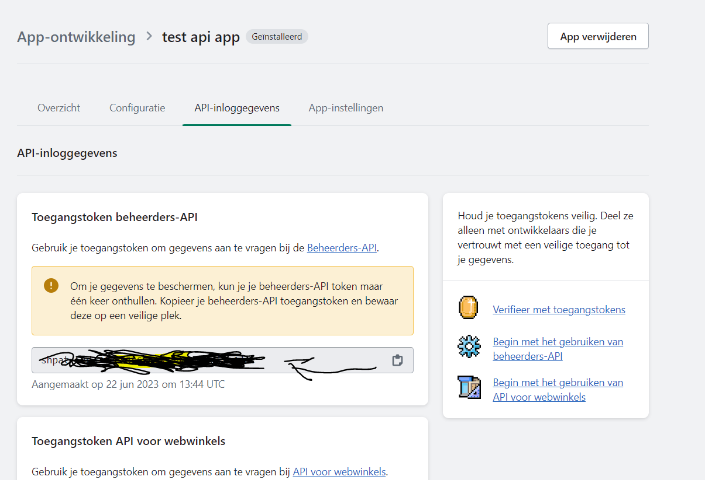

Groups:
Kerstdiner
Pasen
Vaderdag
Moederdag
Customer (zelfde rechten als kerstdiner, pasen)
Finance
Analytics

Users:  
pasen2023  
depaascateraar123

paasdiner2023  
pasen123  
## Database info
#### ApiUrls
api: <className> (e.g.: Paasdiner2023API())
user_id: id of corresponding user
begindatum: date of first order
organisatieIDs: {id1, id2}

#### AlgemeneInformatie
prognosegetal  
aantalHoofdgerechten  
aantalOrders

#### Shopify API
Apps en verkoopkanalen  
App maken  
configureren  
Toegangstoken beheerders API  

## Gerijptebieren
Add partner site to partner_sites and partner_websites

## Routing
Add the hub to orders with voornaam = 'Hub' and id 99999